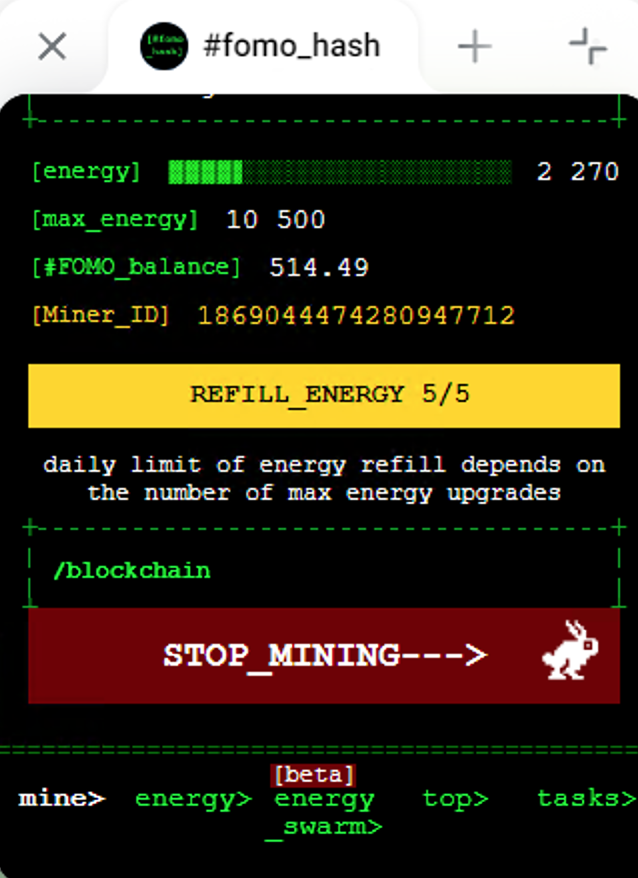

# Fomo-Hash AutoMiner
Keeps AutoMiner always ON in FomoHash crypto game

Sometimes (at night time / low energy) your miner stops working! To make fomohash bot work and mine infinitely, use this script

Also helps in case when bot is overloaded and you cant press the start button - this script will do it automatically as soon as possible

## Last Update
Now miner starts working on 100% energy and stops if energy is below 5% - saving CPU !

+ Autoclosing modal

All checks are once per minute

## How to run
- Install extension in your browser [Violentmonkey](https://chromewebstore.google.com/detail/violentmonkey/jinjaccalgkegednnccohejagnlnfdag?hl=be)
- To enable **automine** install [this script](https://github.com/draftpin/fomo-hash/raw/main/fomohash-automine.user.js)
- Open [Bot Fomo Hash](https://web.telegram.org/k/#?tgaddr=tg%3A%2F%2Fresolve%3Fdomain%3Dfomohash_bot%26app%3Dstart%26startapp%3Dref_LAIDOCYP) and run the game

## 

# Bypass Mobile Check:
https://github.com/draftpin/mobile-check-bypass
